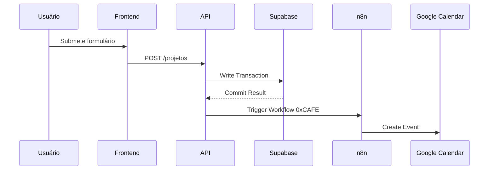

%% PRD Architecture Diagram
graph TD
    A[Frontend] -->|HTTPS| B[API Gateway]
    B --> C[Supabase DB]
    B --> D[n8n Workflows]
    C --> E[(Eventos)]
    C --> F[(Projetos)]
    D --> G[Google Calendar]
    D --> H[Email Service]
```

```typescript
// Modelo de Dados Principal
interface ProjetoLei {
  id: string;
  titulo: string;
  status: 'rascunho' | 'tramitacao' | 'aprovado';
  metricas: {
    apoiadores: number;
    compartilhamentos: number;
    tempoRespostaMedio: number;
  };
  historicoTramitacao: Array<{
    data: Date;
    evento: string;
    documento?: string;
  }>;
}

// Endpoint API Example
POST /api/projetos {
  request: {
    titulo: string;
    descricao: string;
    categorias: string[];
  },
  response: {
    201: ProjetoLei;
    400: { error: 'VALIDATION_ERROR', details: string[] };
  }
}
```

# PRD Técnico - Plataforma Digital Deputada ZELI v2.0

## 1. Especificações de Arquitetura
- **Stack Principal**: React 19 + TypeScript 5.3
- **Requisitos de Sistema**:
  ```json
  {
    "node": ">=20.1.0",
    "bun": ">=1.1.8",
    "supabase": "^4.23.7",
    "testes": {
      "coberturaMinima": 85,
      "limiteLatenciaAPI": "300ms"
    }
  }
  ```

## 2. Fluxos Críticos (Event Sourcing)


## 3. Modelagem de Dados (DDD)
```sql
-- Supabase Schema
create table projetos (
  id uuid primary key,
  titulo text not null check(length(titulo) between 10 and 200),
  status text not null default 'rascunho',
  ts_vector tsvector generated always as (
    to_tsvector('portuguese', titulo)
  ) stored
);

create index idx_projetos_search on projetos using gin(ts_vector);
```

## 4. Métricas Observáveis
```prometheus
# HELP api_requests_total Total de requisições API
# TYPE api_requests_total counter
api_requests_total{endpoint="/projetos",method="POST"} 0

# HELP frontend_performance_seconds Tempo de carregamento
# TYPE frontend_performance_seconds gauge
frontend_performance_seconds{page="home"} 1.2
```

## 5. Casos de Teste Automatizados
```javascript
Deno.test("POST /projetos deve retornar 400 com dados inválidos", async () => {
  const res = await fetch(`${API_URL}/projetos`, {
    method: "POST",
    body: JSON.stringify({ titulo: "" })
  });
  assertEquals(res.status, 400);
});
```

## 6. Pipeline CI/CD
```yaml
steps:
  - name: Build e Teste
    run: bun test --coverage
    env:
      SUPABASE_URL: ${{ secrets.SUPABASE_URL }}
  
  - name: Deploy em Preview
    if: github.ref != 'refs/heads/main'
    uses: vercel-action@v3
    with:
      project-id: ${{ secrets.VERCEL_PROJECT_ID }}
  
  - name: Deploy Produção
    if: github.ref == 'refs/heads/main'
    run: bunx supabase deploy
